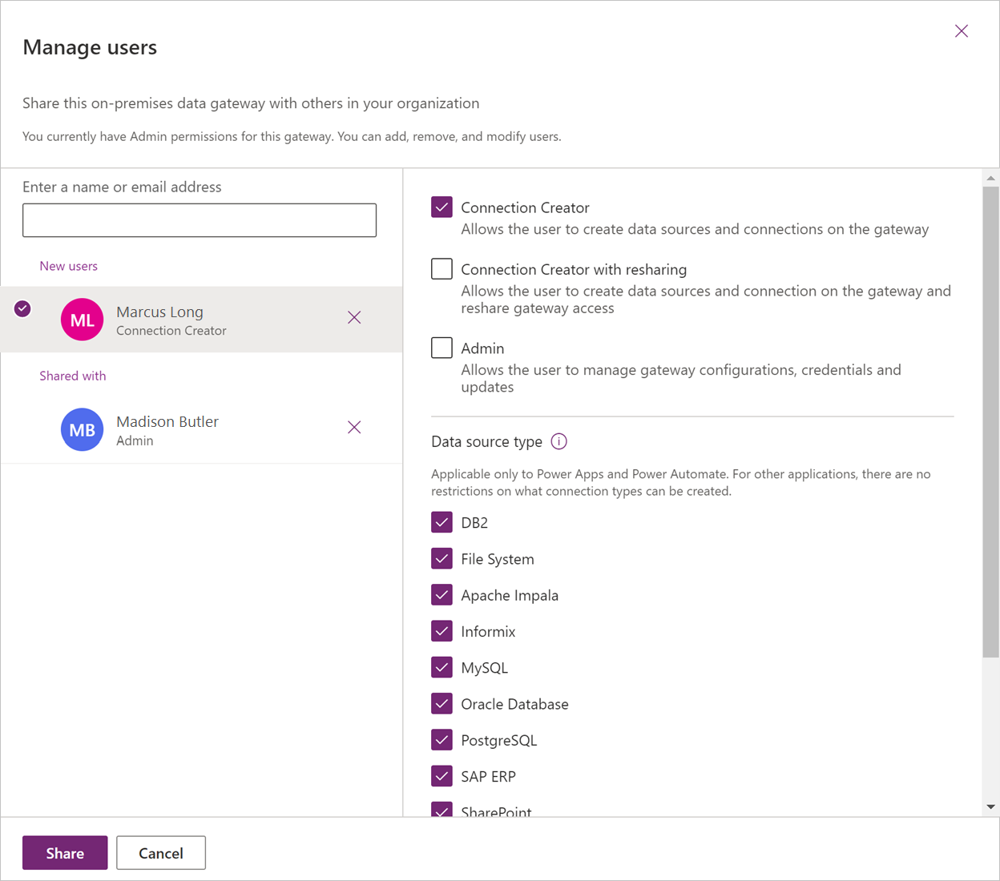
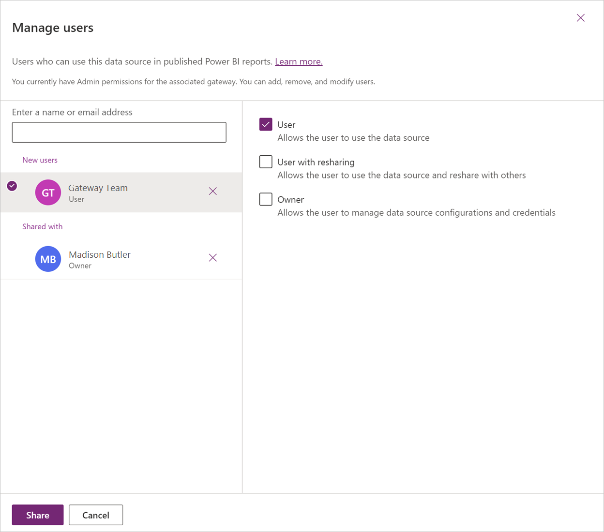
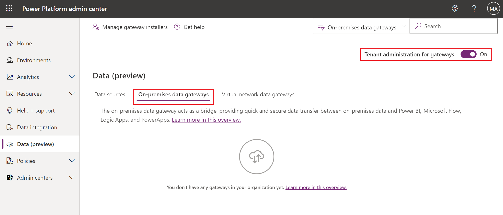
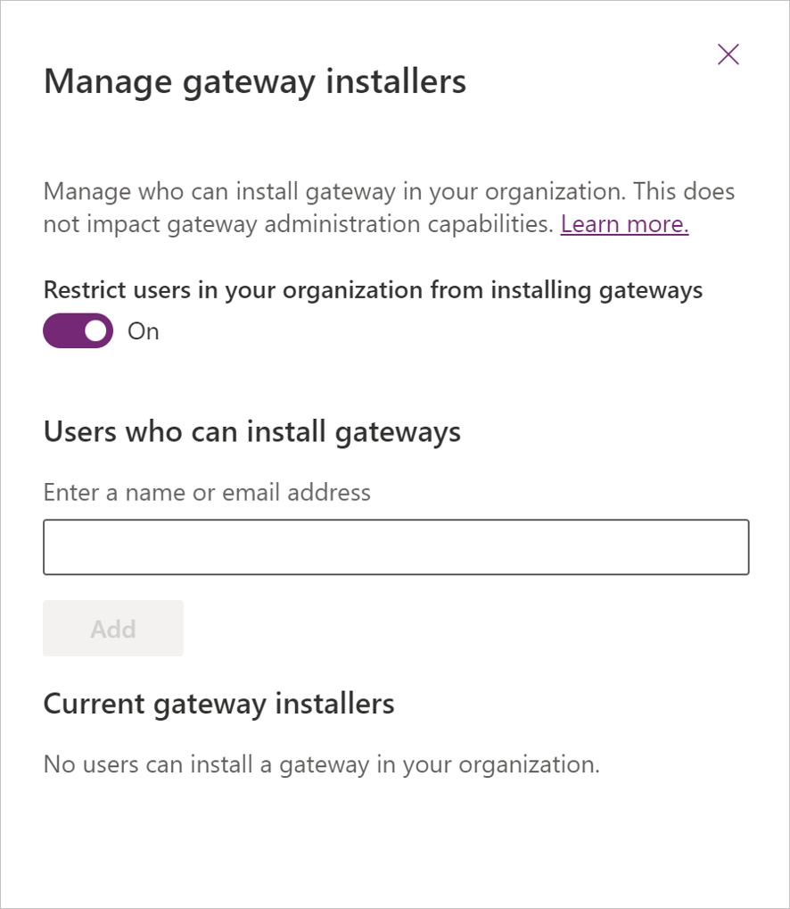

---

title: Manage security roles 
description: Learn how to manage permissions and data sources for the on-premises data gateway.
ms.reviewer: dougklo
ms.topic: conceptual
ms.date: 4/4/2022
---

# Manage security roles of an on-premises data gateway

You can use the on-premises data gateway to transfer data quickly and securely between Power BI or Power Apps and a data source or connection that isn't in the cloud, such as an on-premises SQL Server database or an on-premises SharePoint site. You can also view all on-premises data gateways for which you have permissions, and manage permissions and data sources for those gateways.

## On-premises data gateway and data source permissions

### Gateway roles

There are three security roles for the on-premises data gateway. When you install an on-premises data gateway, you automatically become the admin of the gateway. There can be multiple admins on the gateway.

>[!Note]
>These roles don't apply to a virtual network data gateway. Virtual network data gateways only have the admin role.

The three security roles for the on-premises data gateway are:

* **Admin**: An admin can manage and update the on-premises data gateway. An admin is allowed to create connections (data sources) on the gateway. An admin is allowed to manage (add/delete) users with admin, connection creator, and connection creator with sharing roles on the gateway. An admin can also manage access to all connections created on the gateway.

* **Connection creator**: A connection creator is allowed to create connections/data sources on the gateway. A connection creator can also test the status of the gateway cluster and its members. A connection creator can't manage or update the gateway and can't add or remove others on the gateway.

* **Connection creator with sharing**: A connection creator with sharing is allowed to create connections/data sources on the gateway and test the gateway status. This user is allowed to share the gateway with other users as a connection creator but isn't allowed to remove a user from the gateway.

### Connection roles

>[!Note]
> These roles are only applicable for data sources created in the on-premises data gateway. Cloud data sources can't be shared.

When you create a connection (data source) in the on-premises data gateway, you become the owner of the connection (data source). Multiple owners are allowed.

The three connection roles are:

* **Owner**: The owner of the connection (data source) is allowed to update credentials. An owner can also delete the connection. An owner can assign others to the connection with Owner, User, or User with sharing permissions.  

* **User**: A user is allowed to use the connection (data source) in Power BI reports and Power BI dataflows, or in Power Apps. A user isn't allowed to see or update credentials.

* **User with sharing**: A user with sharing is allowed to use the connection (data source) in Power BI reports and Power BI dataflows, or in Power Apps. A user with sharing is allowed to share the data source with others with User permission.

## How to manage the gateway and connection (data source) roles

To manage on-premises data gateways:

1. Navigate to the [Power Platform admin center](https://admin.powerplatform.microsoft.com/ext/DataGateways).

2. Navigate to the **On-premises data gateways** tab.

3. Select a gateway cluster.

4. In the top ribbon, select **Manage users**.

5. Depending on your role, you can now assign users to the gateway.

   

To manage data sources:

1. Navigate to the [Power Platform admin center](https://admin.powerplatform.microsoft.com/ext/DataGateways).

2. Select a connection (data source).

3. In the top ribbon, select **Manage users**.

4. Depending on your role, you can now assign users to the connection.

   

## Restricting access for on-premises data gateways

You can restrict access to who can install an on-premises data gateway. This restriction occurs though at the tenant level, not the environment level (default environment or otherwise). In other words, you can't restrict access at the environment level.

The admin will update the data gateway settings by environment through the Power Platform Admin Console.

1. Go to the [Power Platform admin center](aka.ms/ppac).

   

2. Select **Data (preview)**.

   

3. Select **On-premises data gateway** and turn on **Tenant administration for gateways**.

   

4. Turn on **Restrict users in your organization from installing gateways**. You can also allow specific users to override the restriction.

   
