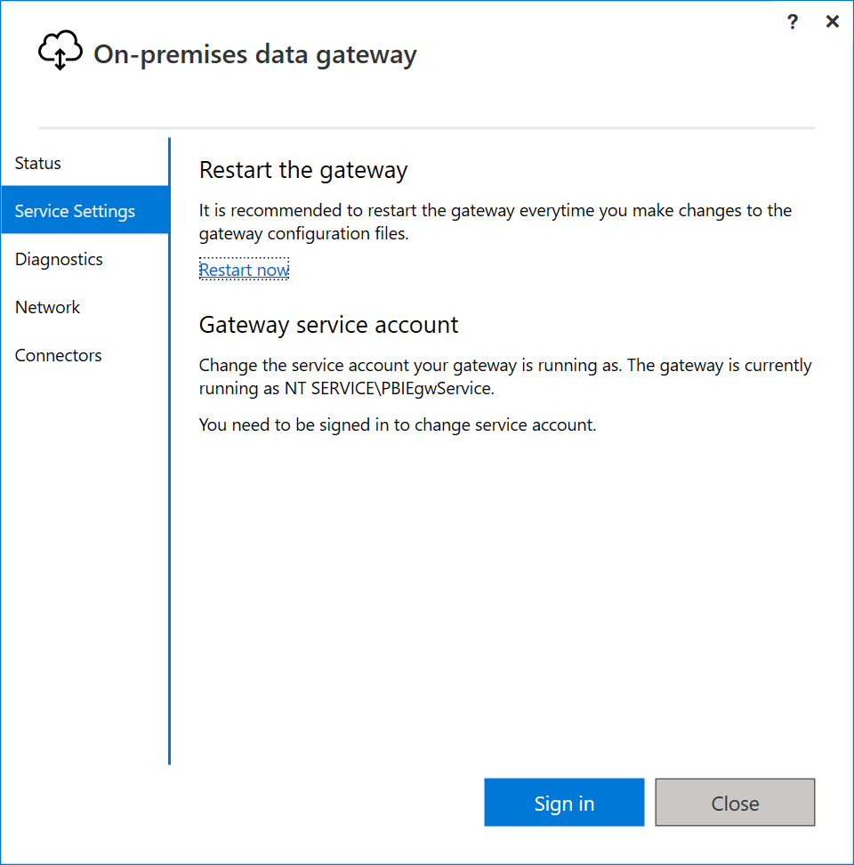

# Use the on-premises data gateway app

To open the on-premises data gateway app:

1. On the machine where the gateway is running, enter **gateway** in Windows search.

2. Select the **on-premises data gateway** app.

    

    

Some of the on-premises data gateway app features can only be used once you've signed on to your Office 356 account. For example, under the **Service Settings** tab, you can restart the gateway without signing on, but you can't change the service account of your gateway without signing on.

## On-premises data gateway app features

Once you've signed on to your Office 356 account, you have access to the following features in the on-premises data gateway app.

|Tab |Service |Description |
| ---- | ---- | ---- |
|Status |Status of the gateway cluster |Indicates whether your gateway is online, the version number of the gateway, and a list of any apps currently associated with the gateway. |
|Service Settings |Restart the gateway |Provides a way of [restarting the gateway](service-gateway-restart.md) whenever a restart is needed. |
|Service Settings |Gateway service account |By default, the gateway is configured to use NT SERVICE\PBIEgwService for the Windows service sign in credential. You can change the [service account](service-gateway-service-account.md) to a domain user account within your Active Directory domain. Or, you can use a managed service account to avoid having to change the password. |
|Diagnostics |Additional logging |Turning this feature on provides [additional verbose information in the log file](service-gateway-performance.md#slow-performing-queries), including duration information. This information can be useful in figuring out why some responses through the gateway are slow. Enabling this feature could increase the log size significantly depending on gateway usage. So, we recommend that you don't leave this setting enabled long term. |
|Diagnostics |Gateway logs |Provides a [copy of all of the gateway logs](service-gateway-tshoot.md#troubleshooting-tools) in a single file in .zip format. |
|Diagnostics |Network ports test |Checks if the gateway has [access to all required ports](service-gateway-communication.md#network-ports-test). |
|Network |Network status |Indicates whether the gateway can reach outside your network. The network status is displayed as either Connected or Disconnected. |
|Network |HTTPS mode |Forces the gateway to communicate with Azure Service Bus by using [HTTPS instead of TCP](service-gateway-communication.md#force-https-communication-with-azure-service-bus) when turned on. |
|Connectors |Custom data connectors |Enables you to connect to and access data from Power BI using custom data connectors that you develop. |

## Next steps

* [Troubleshoot the on-premises data gateway](service-gateway-tshoot.md)