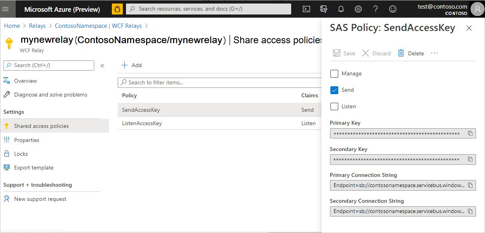

# Set the Azure Relay for on-premises data gateway

During installation of the on-premises data gateway, the Azure Relays are automatically provisioned. However, you have the option to provide your own relay details. This helps you associate the relay with your Azure subscription and also manage the sender and listener keys for this relay. 

>[!NOTE]
>Only WCF relays with NetTcp type are supported for this feature.

**To provide your own relay details**

1.	Select **Provide Relay details**. 

    

2.	You can now provide additional details about your relay.

    
 
    1. **WCF Relay endpoint URI**&mdash;Provide the URI (highlighted below) for your WCF relay from the Azure portal.

       
  
    2. **Send key value and the Listen Key Value**&mdash;Create two shared access policies, one called SendAccessKey and the other ListenAccessKey. Provide either the primary or the secondary keys in the on-premises data gateway app. To learn more, see [Azure Relay authentication and authorization](https://docs.microsoft.com/azure/azure-relay/relay-authentication-and-authorization).

       

>[!Note]
>If you recover an existing gateway with customized relay details to a new machine, you'll have to explicitly uninstall the gateway from the old machine or rotate the sender and listener keys. If this operation isn’t done, then queries through this gateway may fail.

## Next steps

- [What is Azure Relay?](https://docs.microsoft.com/azure/azure-relay/relay-what-is-it)
  
. 
