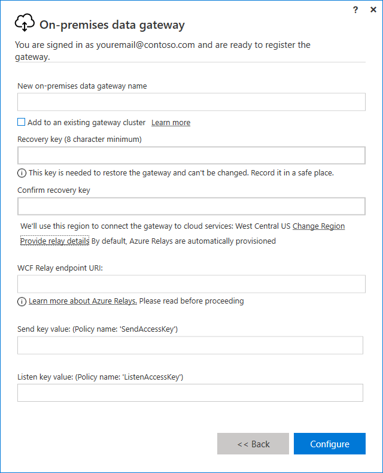
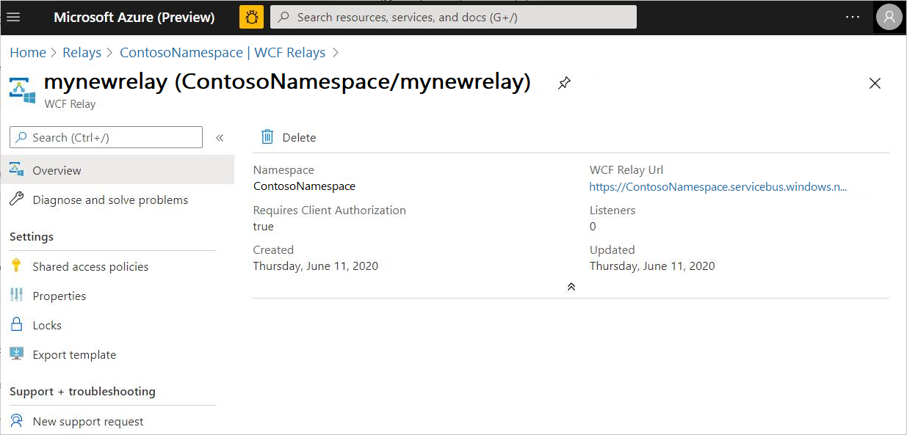

# Set the Azure Relay for on-premises data gateway

During installation of the on-premises data gateway, the Azure Relays are automatically provisioned. However, you can also provide your own relay details. These details help you associate the relay with your Azure subscription and also manage the sender and listener keys for this relay.

>[!NOTE]
> Only WCF relays with NetTcp type are supported for this feature.

## Steps to provide your own relay details

1. Select **Provide Relay details**.

   

2. You can now provide more details about your relay.

   

   1. **WCF Relay endpoint URI**&mdash;Provide the URI (highlighted below) for your WCF relay from the Azure portal.

      
  
   2. **Send key value and the Listen Key Value**&mdash;Create two shared access policies, one called SendAccessKey and the other ListenAccessKey. Provide either the primary or the secondary keys in the on-premises data gateway app. To learn more, go to [Azure Relay authentication and authorization](/azure/azure-relay/relay-authentication-and-authorization).

       

>[!Note]
>If you recover an existing gateway with customized relay details to a new machine, you'll have to explicitly uninstall the gateway from the old machine or rotate the sender and listener keys. If this operation isn't done, then queries through this gateway may fail.

## Keep data in the region where it's stored

If you want to keep your data within the region where it’s stored, all you need to do is:

* [Bring your own relay](#steps-to-provide-your-own-relay-details) that lives in the same region as the data.
* Make sure your capacity is in the same region.

When you install an on-premises data gateway, it must be in the home tenant region to work with Power BI. Data from your gateway must travel to the relay, then to the location of your [Power BI capacity](/power-bi/enterprise/service-admin-premium-manage). An Azure Relay automatically gets installed in the same region as the on-premises data gateway.

However, you have the option to choose your own relay in a different location. Then, the data will transfer through the location of your assigned relay instead. Only metadata will go to the gateway application in the home region and this condition can't be changed. This means you can keep your data within the region it's stored in if your relay, the capacity, and the data are all in the same region.

## Next steps

* [What is Azure Relay?](/azure/azure-relay/relay-what-is-it)

[!INCLUDE[footer-include](../includes/footer-banner.md)]
