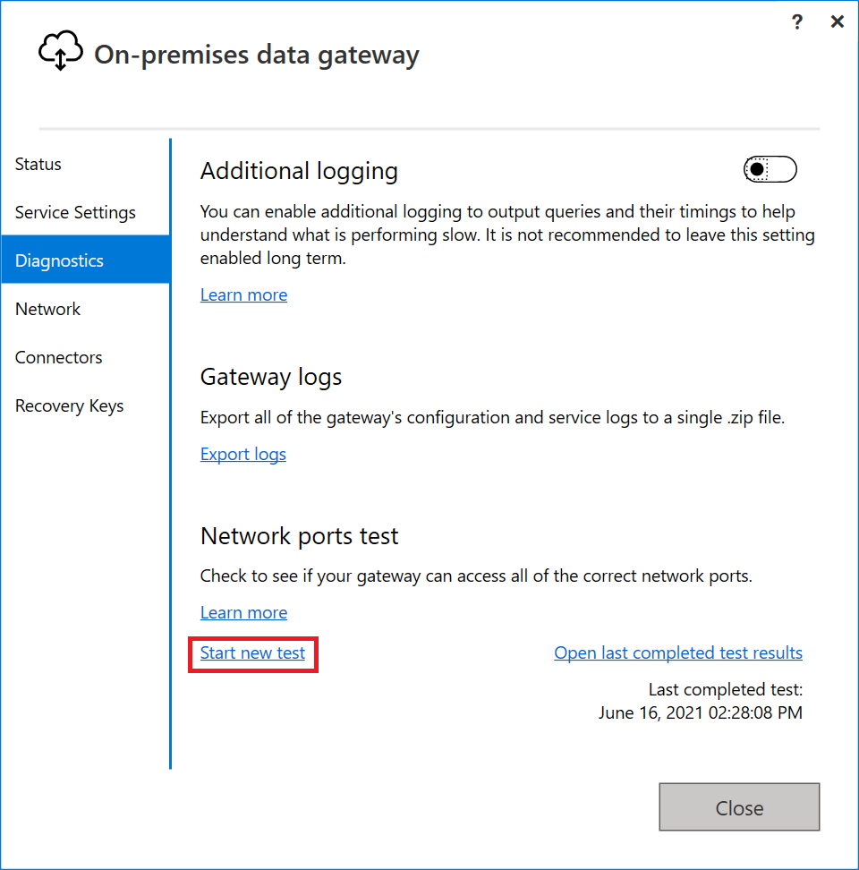
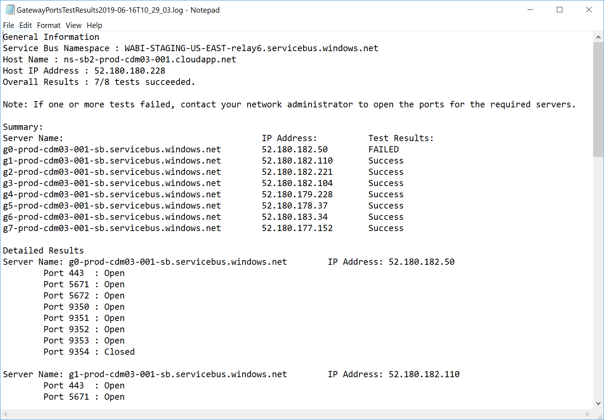

# Adjust communication settings for the on-premises data gateway

This article describes several communication settings associated with the on-premises data gateway. These settings need to be adjusted to support data source connections and output destination access.

## Enable outbound Azure connections

The gateway relies on Azure Relay for cloud connectivity. The gateway correspondingly establishes outbound connections to its associated Azure region.

If you registered for either a Power BI tenant or an Office 365 tenant, your Azure region defaults to the region of that service. Otherwise, your Azure region might be the one closest to you.

If a firewall blocks outbound connections, configure the firewall to allow outbound connections from the gateway to its associated Azure region. The firewall rules on the gateway server and/or customer's proxy servers need to be updated to allow outbound traffic from the gateway server to the below endpoints. If your firewall does not support wildcards, then use the IP addresses from [Azure IP Ranges and Service Tags](https://www.microsoft.com/en-us/download/details.aspx?id=56519). Note that they will need to be kept in sync each month.

## Ports

The gateway communicates on the following outbound ports: TCP 443, 5671, 5672, and from 9350 through 9354. The gateway doesn't require inbound ports.

We recommend that you allow the "\*.servicebus.windows.net" Domain Name System (DNS). For guidance on how to set up your on-premises firewall and/or proxy using fully qualified domain names (FQDNs) instead of using IP addresses that are subject to change, follow the steps in [Azure WCF Relay DNS Support](https://techcommunity.microsoft.com/t5/messaging-on-azure/azure-wcf-relay-dns-support/ba-p/370775).

Alternatively, you allow the IP addresses for your data region in your firewall. Use the JSON files listed below, which are updated weekly.

* [Public Cloud](https://www.microsoft.com/download/details.aspx?id=56519)
* [US Gov](https://www.microsoft.com/download/details.aspx?id=57063)
* [Germany](https://www.microsoft.com/download/details.aspx?id=57064)
* [China](https://www.microsoft.com/download/details.aspx?id=57062)

Or, you can get the list of required ports by performing the [network ports test](#network-ports-test) periodically in the gateway app.

The gateway communicates with Azure Relay by using FQDNs. If you force the gateway to communicate via HTTPS, it will strictly use FQDNs only and won't communicate by using IP addresses.

> [!NOTE]
> The Azure datacenter IP list shows IP addresses in Classless Inter-Domain Routing (CIDR) notation. An example of this notation is 10.0.0.0/24, which doesn't mean from 10.0.0.0 through 10.0.0.24. Learn more about [CIDR notation](https://whatismyipaddress.com/cidr).

The following list describes FQDNs used by the gateway. These endpoints are required for the gateway to function.

| Public Cloud Domain names | Outbound ports | Description |
| --- | --- | --- |
| \*.download.microsoft.com |80 |Used to download the installer. The gateway app also uses this domain to check the version and gateway region. |
| \*.powerbi.com |443 |Used to identify the relevant Power BI cluster. |
| \*.analysis.windows.net |443 |Used to identify the relevant Power BI cluster. |
| \*.login.windows.net, login.live.com, aadcdn.msauth.net, login.microsoftonline.com, *.microsoftonline-p.com |443 |Used to authenticate the gateway app for Microsoft Entra ID and OAuth2. Note that additional URLs could be required as part of the Microsoft Entra ID sign in process that can be unique to a tenant. |
| \*.servicebus.windows.net |5671-5672 |Used for Advanced Message Queuing Protocol (AMQP). |
| \*.servicebus.windows.net |443 and 9350-9354 |Listens on Azure Relay over TCP. Port 443 is required to get Azure Access Control tokens. |
| \*.msftncsi.com |80 |Used to test internet connectivity if the Power BI service can't reach the gateway. |
| \*.dc.services.visualstudio.com |443 |Used by AppInsights to collect telemetry. |
| \*.frontend.clouddatahub.net |443 |Required for Fabric Pipeline execution. |

For GCC, GCC high, and DoD, the following FQDNs are used by the gateway.

| Ports | GCC | GCC High | DoD |
| --- | --- | --- | --- |
| 80 | \*.download.microsoft.com |\*.download.microsoft.com |\*.download.microsoft.com |
| 443 | \*.powerbigov.us, \*.powerbi.com  |\*.high.powerbigov.us |\*.mil.powerbigov.us|
| 443 | \*.analysis.usgovcloudapi.net |\*.high.analysis.usgovcloudapi.net |\*.mil.analysis.usgovcloudapi.net |
| 443 | \*.login.windows.net, \*.login.live.com, \*.aadcdn.msauth.net |[Go go documentation](/microsoft-365/enterprise/microsoft-365-u-s-government-gcc-high-endpoints?preserve-view=true&view=o365-worldwide#microsoft-365-common-and-office-online)|[Go to documentation](/microsoft-365/enterprise/microsoft-365-u-s-government-gcc-high-endpoints?preserve-view=true&view=o365-worldwide#microsoft-365-common-and-office-online) |
|5671-5672| \*.servicebus.usgovcloudapi.net |\*.servicebus.usgovcloudapi.net|\*.servicebus.usgovcloudapi.net |
|443 and 9350-9354| \*.servicebus.usgovcloudapi.net |\*.servicebus.usgovcloudapi.net |\*.servicebus.usgovcloudapi.net |
|443| \*.core.usgovcloudapi.net|\*.core.usgovcloudapi.net|\*.core.usgovcloudapi.net |
|443| \*.login.microsoftonline.com |\*.login.microsoftonline.us |\*.login.microsoftonline.us |
|443| \*.msftncsi.com |\*.msftncsi.com |\*.msftncsi.com |
|443| \*.microsoftonline-p.com |\*.microsoftonline-p.com |\*.microsoftonline-p.com |
|443| \*.dc.applicationinsights.us |\*.dc.applicationinsights.us |\*.dc.applicationinsights.us |

For China Cloud (Mooncake), the following FQDNs are used by the gateway.

| Ports | China Cloud (Mooncake) |
| --- | --- |
| 80 | \*.download.microsoft.com |
| 443 | \*.powerbi.cn |
| 443 | \*.asazure.chinacloudapi.cn |
| 443 | \*.login.chinacloudapi.cn |
|5671-5672| \*.servicebus.chinacloudapi.cn |
|443 and 9350-9354| \*.servicebus.chinacloudapi.cn |
|443| \*.chinacloudapi.cn |
|443| login.partner.microsoftonline.cn |
|443| No Mooncake equivalent&mdash;not required to run the gateway&mdash;only used to check network during failure conditions |
|443| No Mooncake equivalent&mdash;used during Microsoft Entra ID sign in. For more information about Microsoft Entra ID endpoints, go to [Check the endpoints in Azure](https://docs.azure.com/articles/guidance/developerdifferences)
|443| applicationinsights.azure.cn |
|433| clientconfig.passport.net |
|433| aadcdn.msftauth.cn |
|433| aadcdn.msauth.cn |

> [!NOTE]
> After the gateway is installed and registered, the only required ports and IP addresses are those needed by Azure Relay, as described for servicebus.windows.net in the preceding table. You can get the list of required ports by performing the [Network ports test](#network-ports-test) periodically in the gateway app. You can also force the gateway to [communicate using HTTPS](#force-https-communication-with-azure-relay).

## Opening extra ports for Dataflow Gen1 and Gen2 using OPDG

In Dataflow Gen1 and Gen2 within Fabric Data Factory, when a Mashup query combines an on-premises data source (connected through an on-premises data gateway) with a cloud data source, the entire query is executed on the on-premises data gateway. Therefore, the following endpints must be open to alloww on-premises data gateway line-of-sight access to the cloud data sources.

| Public Cloud Domain names | Outbound ports | Description |
| --- | --- | --- |
| \*.core.windows.net |443 |Used by Dataflow Gen1 to write data to Azure Data Lake. |
| \*.datawarehouse.pbidedicated.windows.net |1433 |Old endpoint by Dataflow Gen2 to connect to the staging lakehouse. [Learn more](/fabric/data-factory/gateway-considerations-output-destinations#solution-set-new-firewall-rules-on-server-running-the-gateway)|
| \*.datawarehouse.fabric.microsoft.com |1433 |New endpoint used by Dataflow Gen2 to connect to the staging lakehouse. [Learn more](/fabric/data-factory/gateway-considerations-output-destinations#solution-set-new-firewall-rules-on-server-running-the-gateway) |
| \*.dfs.fabric.microsoft.com  |1433 |Endpoint used by Dataflow Gen2 to connect to OneLake. |

> [!NOTE]
> \*.datawarehouse.pbidedicated.windows.net is being replaced by \*.datawarehouse.fabric.microsoft.com. During this transition process, make sure to have both endpoints open to ensure Dataflow Gen2 refresh.

## Network ports test

To test if the gateway has access to all required ports:

1. On the machine that is running the gateway, enter "gateway" in Windows search, and then select the **On-premises data gateway** app.

1. Select **Diagnostics**. Under **Network ports test**, select **Start new test**.

   

When your gateway runs the network ports test, it retrieves a list of ports and servers from Azure Relay and then attempts to connect to all of them. When the **Start new test** link reappears, the network ports test has finished.

The summary result of the test is either "Completed (Succeeded)" or "Completed (Failed, see last test results)". If the test succeeded, your gateway connected to all the required ports. If the test failed, your network environment might have blocked the required ports and servers.

> [!NOTE]
> Firewalls often intermittently allow traffic on blocked sites. Even if a test succeeds, you might still need to allowlist that server on your firewall.

To view the results of the last completed test, select the **Open last completed test results** link. The test results open in your default text editor.

The test results list all the servers, ports, and IP addresses that your gateway requires. If the test results display "Closed" for any ports as shown in the following screenshot, ensure that your network environment didn't block those connections. You might need to contact your network admin to open the required ports.



## Force HTTPS communication with Azure Relay

You can force the gateway to communicate with Azure Relay by using HTTPS instead of direct TCP.

> [!NOTE]
> Starting with the June 2019 gateway release and based on recommendations from Relay, new installations default to HTTPS instead of TCP. This default behavior doesn't apply to updated installations.

You can use the [gateway app](service-gateway-app.md) to force the gateway to adopt this behavior. In the gateway app, select **Network**, and then turn on **HTTPS mode**.


After you make this change and then select **Apply**, the gateway Windows service restarts automatically so that the change can take effect. The **Apply** button appears only when you make a change.

To restart the gateway Windows service from the gateway app, go to [Restart a gateway](service-gateway-restart.md).

> [!NOTE]
>If the gateway can't communicate by using TCP, it automatically uses HTTPS. The selection in the gateway app always reflects the current protocol value.

## TLS 1.3 for gateway traffic

By default, the gateway uses Transport Layer Security (TLS) 1.3 to communicate with the Power BI service. To ensure all gateway traffic uses TLS 1.3, you might need to add or modify the following registry keys on the machine that runs the gateway service.

```
[HKEY_LOCAL_MACHINE\SOFTWARE\Microsoft\.NETFramework\v4.0.30319]"SchUseStrongCrypto"=dword:00000001

[HKEY_LOCAL_MACHINE\SOFTWARE\Wow6432Node\Microsoft\.NETFramework\v4.0.30319]"SchUseStrongCrypto"=dword:00000001
```

> [!NOTE]
> Adding or modifying these registry keys applies the change to all .NET applications. For information about registry changes that affect TLS for other applications, go to [Transport Layer Security (TLS) registry settings](/windows-server/security/tls/tls-registry-settings).

## Service tags

A service tag represents a group of IP address prefixes from a given Azure service. Microsoft manages the address prefixes encompassed by the service tag and automatically updates the service tag as addresses change, minimizing the complexity of frequent updates to network security rules. The data gateway has dependencies on the following service tags:

* PowerBI
* ServiceBus
* AzureActiveDirectory
* AzureCloud

The on-premises data gateway uses Azure Relay for some communication. However, there are no service tags for the Azure Relay service. ServiceBus service tags are still required though because they still pertain to the service queues and topics feature, even though not for Azure Relay.

The AzureCloud service tag represents all global Azure Data Center IP addresses. Since Azure Relay service is built on top of Azure Compute, Azure Relay public IPs are a subset of the AzureCloud IPs. More information: [Azure service tags overview](/azure/virtual-network/service-tags-overview)

## Next steps

* [Configure the gateway log file](service-gateway-log-files.md)
