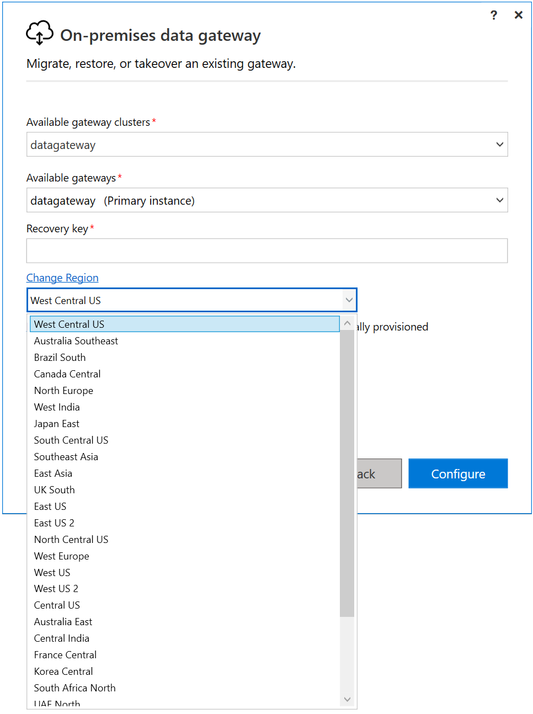

# Set the data center region for the on-premises data gateway

[!INCLUDE [gateway-rewrite](../includes/gateway-rewrite.md)]

During gateway installation, you can set the data center region used by the gateway. By default, the data center region is the region of your Power BI tenant or your Office 365 tenant if you have registered for either of these services. If not, it may be the closest Azure region to you.

## Change the data center region

If you want to change the data center region after your gateway is installed, you can:

- Restore the on-premises data gateway on the current gateway machine.
- Migrate or take over the on-premises data gateway on a different machine.

## Current data center region

To find the current data center region you're in after the gateway is installed:

1. Open the [on-premises data gateway app](service-gateway-app.md) and sign in to your account.
2. In the **Status** tab, your data region is listed under **Logic Apps, Azure Analysis Services**.

   

For more information about setting the data region for your resources, [watch this video](https://guyinacube.com/2018/01/power-bi-azure-analysis-services-gateway-data-region/).

## Next steps

* [Adjust communications settings](service-gateway-communication.md)
