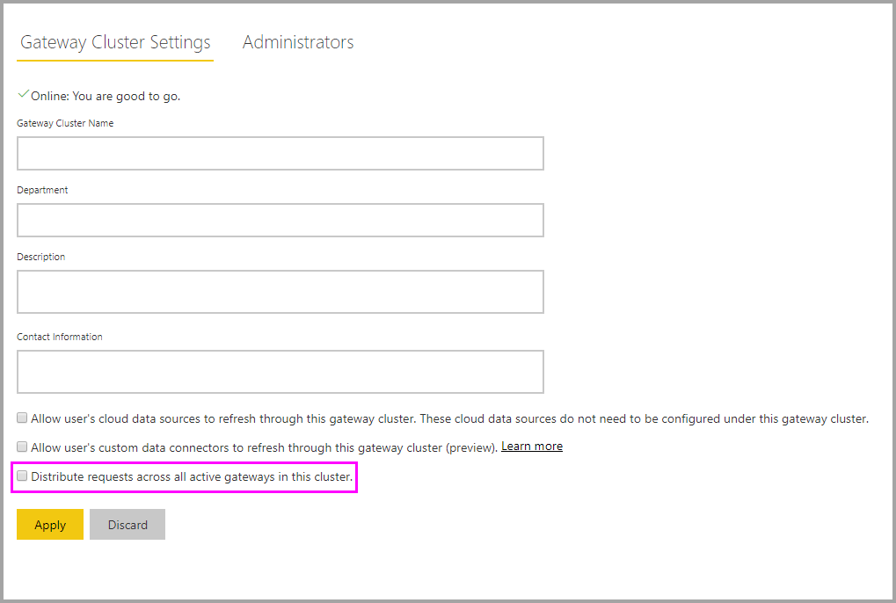

# Manage on-premises data gateway high-availability clusters and load balancing

You can use an on-premises data gateway cluster to avoid single points of failure and to load balance traffic across gateways in a cluster. To add new gateway members to a gateway cluster, see [Add another gateway to create a cluster](service-gateway-install.md#add-another-gateway-to-create-a-cluster).

## High-availability clusters for an on-premises data gateway

You can create high-availability clusters of gateway installations. The clusters help ensure that your organization can access on-premises data resources from cloud services like Power BI and Power Apps. Gateway admins use such clusters to avoid single points of failure when accessing on-premises data resources.

The gateway cloud service always uses the primary gateway in a cluster unless that gateway isn't available. In that case, the service switches to the next available gateway in the cluster.

>[!Note]
> Make sure the gateway members in a cluster are running the same gateway version, as different versions could cause unexpected failures based on supported functionality.

### Manage a gateway cluster

After you create a cluster of two or more gateways, all gateway management operations apply to every gateway in the cluster. These operations include granting administrative permissions to a gateway and adding data sources or connections.

For example, when admins select **Manage gateways** in Power BI, they see the list of registered clusters or individual gateways. But, they don't see the individual gateway instances that are members of the cluster.

All requests are routed to the primary instance of a gateway cluster. If the primary gateway instance isn't online, the request is routed to another gateway instance in the cluster.

## Load balance across gateways in a cluster

You can choose to let traffic be distributed evenly across gateways in a cluster. By default, the selection of a gateway during load balancing&mdash;that is, when "Distribute requests across all active gateways in this cluster" is enabled&mdash;is random. You can change this setting to distribute the load.

> [!NOTE]
> It is recommended to disable or remove an offline gateway member in the cluster. If a gateway member is offline instead of disabled or removed, we may try to excecute a query on that offline member, before moving to the next one. This can negatively impact the performance.

For example, to provide load balancing from the Power BI service, select the gear icon  in the upper-right corner, then select **Manage gateways**. Next, select **Distribute requests across all active gateways in this cluster**.

## Load balance based on CPU and Memory throttling

As mentioned earlier, the selection of a gateway during load balancing is random. Gateway admins can, however, now throttle the resources of each gateway member. With throttling, you can make sure either a gateway member or the entire gateway cluster isn't overloaded, causing system failures. 

If a gateway cluster with load balancing enabled receives a request from one of the cloud services (like Power BI), it randomly selects a gateway member. If this member is already at or over the throttling limit set for CPU or memory, another member within the cluster is selected. If all members within the cluster are in the same state, the request fails.

To enable this feature, a gateway admin should update the following settings in  the _Microsoft.PowerBI.DataMovement.Pipeline.GatewayCore.dll.config_ file available in the _Program Files\On-premises data gateway\_ folder.

- **CPUUtilizationPercentageThreshold** - This configuration allows gateway admins to set a throttling limit for CPU. The permissible range for this configuration is 0 to 100. A value of 0, which is the default, indicates that this configuration is disabled.

- **MemoryUtilizationPercentageThreshold** - This configuration allows gateway admins to set a throttling limit for memory. The permissible range for this configuration is 0 to 100. A value of 0, which is the default, indicates that this configuration is disabled.

- **ResourceUtilizationAggregationTimeInMinutes** - This configuration sets the time in minutes for which CPU and memory system counters of the gateway machine are aggregated. The aggregated values are then compared against the respective threshold limits set for **CPUUtilizationPercentageThreshold** and **MemoryUtilizationPercentageThreshold**. The default value for this configuration is 5.

> [!NOTE]
> You can also change the load balancing setting through [PowerShell](/powershell/module/datagateway/set-datagatewaycluster).

## Next steps

[PowerShell support for gateway clusters](service-gateway-powershell-support.md)

[!INCLUDE[footer-include](../includes/footer-banner.md)]
