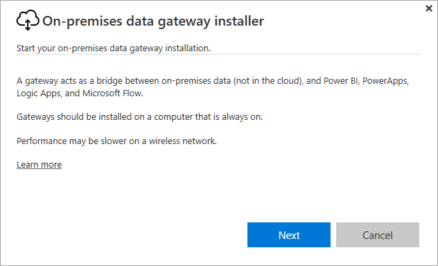
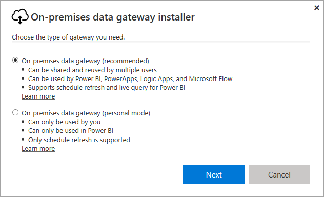
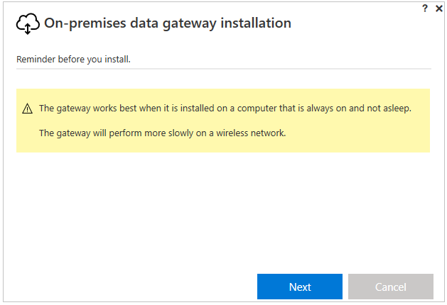
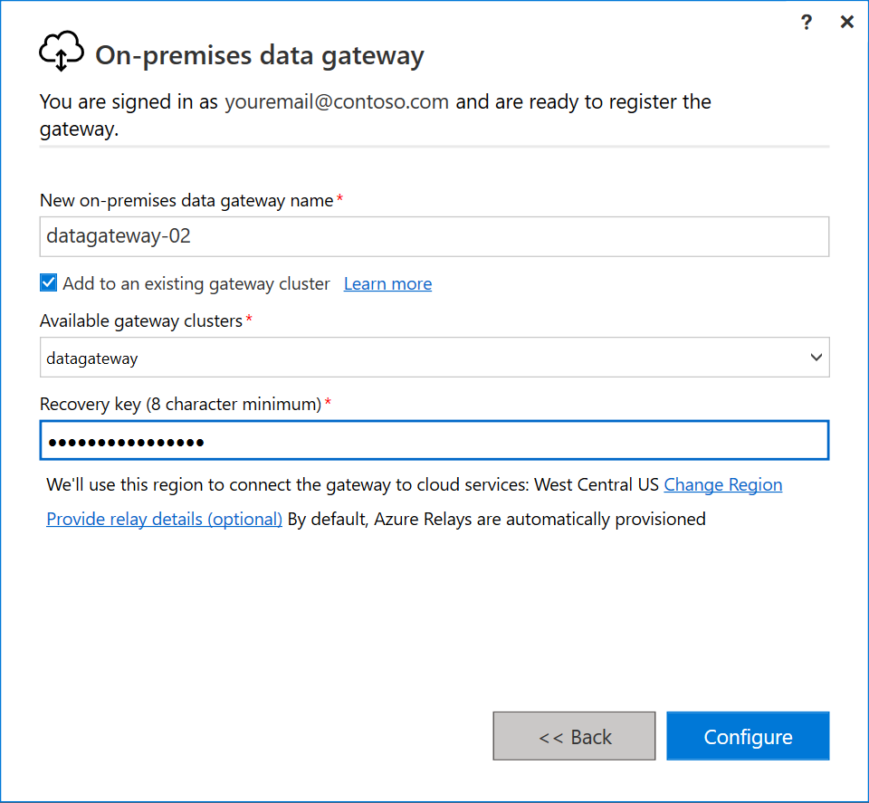

# Install an on-premises data gateway

An on-premises data gateway is software that you install in an on-premises network. It facilitates access to data in that network. As we explained in the [overview](service-gateway-onprem.md), you can install a gateway in standard mode (recommended) or personal mode (Power BI only). In standard mode, you can install a stand-alone gateway or add a gateway to a *cluster*, which we recommend for high availability. In this article, we show you how to install a standard gateway and then add another gateway to create a cluster.

## Requirements

Minimum requirements:

* .NET Framework 4.6
* 64-bit version of Windows 7 / Windows Server 2008 R2 (or later)

Recommended:

* 8-core CPU
* 8 GB of memory
* 64-bit version of Windows Server 2012 R2 (or later)
* Solid state drive (SSD) based storage for spooling

Related considerations:

* The user installing the gateway is required to be the admin of the gateway.
* The gateway can't be installed on a domain controller.
* If you're planning to use Windows authentication, make sure you install the gateway on a computer that's a member of the same Active Directory environment as the data sources.
* You shouldn't install a gateway on a computer, like a laptop, that might be turned off, asleep, or disconnected from the internet. The gateway can't run under any of those circumstances. Also, gateway performance might suffer over a wireless network.
* You can install up to two on-premises data gateways on a single computer, one running in each mode (personal and standard). You can't have more than one gateway running in the same mode on the same computer.

## Download and install a gateway

The gateway runs on the computer that you install it on, so be sure to install it on a computer that's always on. For better performance and reliability, we recommend that the computer is on a wired network rather than a wireless one.

1. [Download the on-premises data gateway](https://go.microsoft.com/fwlink/?LinkId=820925&clcid=0x409).

2. In the installer, select **Next**.

    

3. Select **On-premises data gateway (recommended)** > **Next**.

    

4. Select **Next**.

    

5. Keep the default installation path, accept the terms, and then select **Install**.

    

6. Enter the email address for your Office 356 organization account, and then select **Sign in**.

    

    > [!NOTE]
    > You need to sign in with either a work account or a school account. This account is an *organization account*. If you signed up for an Office 365 offering and didn't supply your work email address, the address might look like nancy\@contoso.onmicrosoft.com. Your account is stored within a tenant in Azure Active Directory (Azure AD). In most cases, your Azure AD account’s User Principal Name (UPN) will match the email address.  

    The gateway is associated with your Office 356 organization account, and you manage gateways from within the associated service. You're now signed in to your account.

7. Select **Register a new gateway on this computer** > **Next**.

    

8. Enter a name for the gateway (it must be unique across the tenant) and a recovery key. You'll need this key if you ever want to recover or move your gateway. Select **Configure**.

    

    Notice the **Add to an existing gateway cluster** option. We'll use this option in the next section of this article.

    Also note that you can change the region that connects the gateway to cloud services. The region should be changed to the region of your Power BI tenant or your Office 356 tenant, or the closest Azure region to you. For more information, see [Set the data center region](service-gateway-data-region.md).

9. Review the information in the final window. Notice that the gateway is available for Power BI, PowerApps, and Microsoft Flow, because in this example we use the same account for all three. Select **Close**.

    

Now that you've installed a gateway, you can add another gateway to create a cluster.

## Add another gateway to create a cluster

A cluster allows gateway admins to avoid having a single point of failure for on-premises data access. If the primary gateway is unavailable, data requests are routed to the second gateway that you add, and so on. You can install only one standard gateway on a computer, so you have to install the second gateway for the cluster on a different computer. This makes sense because you want redundancy in the cluster.

To create high availability gateway clusters, you need the November 2017 or later update to on-premises data gateway.

1. Download the gateway to a different computer and install it.

2. After you sign in to your Office 356 organization account, register the gateway. Select **Add to an existing cluster**. Under **Available gateway clusters**, select the first gateway you installed (the *primary gateway*), and enter the recover key for that gateway. Select **Configure**.

    

## Next steps

* [Configure on-premises data gateways](service-gateway-app.md)

* [Manage an on-premises data gateway](service-gateway-manage.md)

* [Monitor and optimize gateway performance](service-gateway-performance.md)
