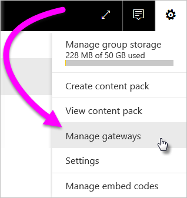

# Manage an on-premises data gateway

After you install an on-premises data gateway, you manage it based on your requirements. Because each service might integrate gateways differently, the management options differ depending on the service. Although you can manage gateways from any service, the articles in this section refer to the **Manage gateways** page in Power BI.

> [!NOTE]
> **Manage gateways** will not show up until you're the admin of at least one gateway. You become an admin either by being added as an admin or because you installed and configured a gateway.

## Manage gateway admins

When you install a gateway, you are by default an admin of that gateway. You then add additional users or security groups as admins by using the **Administrators** tab for the gateway. You also use this tab to remove admins.

>[!NOTE]
>Security groups without email addresses can't be added.

## Remove or delete an on-premises data gateway

Depending on the service you're using you can either remove or delete a gateway. In Power BI you remove a gateway, but in Power Apps and Power Automate, you delete a gateway.

But, be aware that removing a gateway in Power BI deletes all the data sources under it. In turn, deleting the Power BI data sources causes errors in Power BI dashboards and reports that rely on those data sources.

> [!NOTE]
> If you remove or delete a gateway cluster in any of the cloud services, you won't be able to [restore](service-gateway-migrate.md) it. Also, when you remove or delete a gateway cluster, the gateway is not uninstalled from the gateway machines. You have to manually uninstall the gateway from each machine in the cluster.

For example, to remove a gateway in the Power BI service:

1. In the upper-right corner of the Power BI service, select the gear icon  > **Manage gateways**.

1. Select the gateway and then select **Remove**.

   

## Next steps

* [Manage high availability clusters and load balancing](service-gateway-high-availability-clusters.md)

* [Tenant level administration](service-gateway-tenant-level-admin.md)
