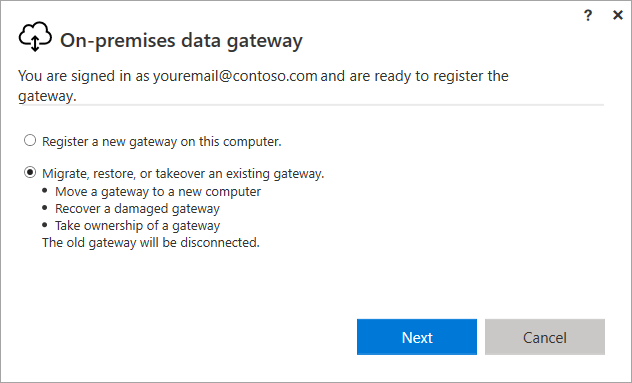
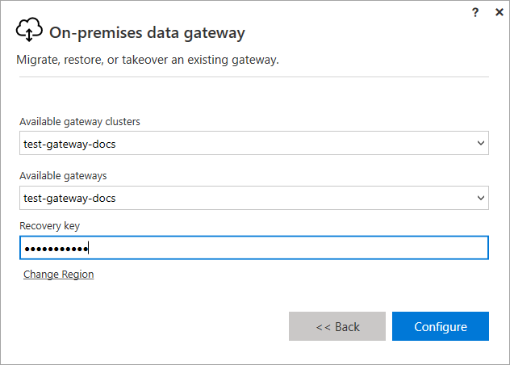

# Migrate, restore, or take over a gateway

Run the gateway installer on a computer where you want to migrate, restore, or take over the gateway.

If you're restoring the gateway on the same computer as the original gateway was installed on, you must first uninstall the gateway on that computer before restoring the gateway.

> [!NOTE]
> If you [remove or delete a gateway cluster](service-gateway-manage.md#remove-or-delete-an-on-premises-data-gateway) in any of the cloud services, you will not be able to restore it.

1. Download the gateway and install it. For more information, see [Install an on-premises data gateway](service-gateway-install.md).

2. After you've signed in to your Office 356 account, register the gateway. Select **Migrate, restore, or take over an existing gateway** > **Next**.

    

3. Select from the available clusters and gateways, and enter the recover key for the selected gateway. The recovery key is the one you created and safely stored when you originally installed the gateway (see step 7 in [Install an on-premises data gateway](service-gateway-install.md)).

4. Select **Configure**.

    

Once the configuration finishes, the migrate, restore, or takeover process is complete.

## Next steps

* [Troubleshoot the on-premises data gateway](service-gateway-tshoot.md)
