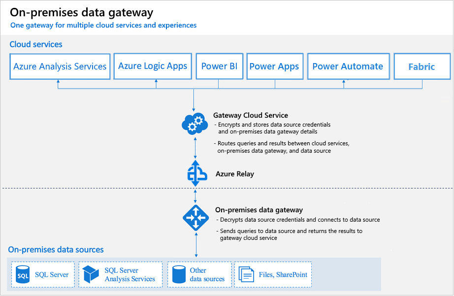

# On-premises data gateway architecture

Users in your organization can access on-premises data to which they already have access authorization. But before those users can connect to your on-premises data source, an on-premises data gateway needs to be installed and configured.

The gateway facilitates quick and secure behind-the-scenes communication. This communication flows from a user in the cloud to your on-premises data source and then back to the cloud.

An admin is usually the one who installs and configures a gateway. These actions might require special knowledge of your on-premises servers or Server Administrator permissions.

This article doesn't provide step-by-step guidance on how to install and configure the gateway. For that guidance, be sure to see [Install an on-premises data gateway](service-gateway-install.md). This article does provide in-depth understanding of how the gateway works.

## How the gateway works

Let's first look at what happens when you interact with an element that is connected to an on-premises data source.

> [!NOTE]
> Depending on the cloud service, you might need to configure a data source for the gateway.

1. The cloud service creates a query and the encrypted credentials for the on-premises data source. The query and credentials are sent to the gateway queue for processing. For more information about credential encryption in Power BI, see [Power BI security whitepaper](/power-bi/guidance/whitepaper-powerbi-security).
1. The gateway cloud service analyzes the query and pushes the request to [Azure Service Bus Messaging](/azure/service-bus-messaging/service-bus-messaging-overview/). 
1. Azure Service Bus sends the pending requests to the gateway. Both the gateway and Power BI service are implemented to only accept TLS 1.2 traffic.
1. The gateway gets the query, decrypts the credentials, and connects to one or more data sources with those credentials.
1. The gateway sends the query to the data source to be run.
1. The results are sent from the data source back to the gateway and then to the cloud service. The service then uses the results.

In step 6, queries like Power BI refreshes and Azure Analysis Services refreshes can return large amounts of data. For such queries, data is temporarily stored on the gateway machine. This data storage continues until all data is received from the data source. The data is then sent back to the cloud service. This process is called spooling. We recommend you use a solid-state drive (SSD) as the spooling storage.

## Authentication to on-premises data sources

A stored credential is used to connect from the gateway to on-premises data sources. Regardless of the user, the gateway uses the stored credential to connect. But there might be authentication exceptions like DirectQuery and LiveConnect for Analysis Services in Power BI. For more information about credential encryption in Power BI, see [Power BI security whitepaper](/power-bi/guidance/whitepaper-powerbi-security).

## Sign-in account

You sign in with either a work account or a school account. This account is your organization account. If you signed up for an Office 365 offering and didn't supply your actual work email address, your account name might look like nancy@contoso.onmicrosoft.com. A cloud service stores your account within a tenant in Azure Active Directory (Azure AD). In most cases, the User Principal Name (UPN) of your Azure AD account matches your email address.

## Network traffic security

Traffic goes from the gateway to Azure Service Bus to the Power BI backend cluster. This traffic doesn't traverse the public internet. All Azure internal traffic goes over the Azure backbone.

## Azure Active Directory

Microsoft cloud services use [Azure AD](/azure/active-directory/fundamentals/active-directory-whatis) to authenticate users. Azure AD is the tenant that contains usernames and security groups. Typically, the email address that you use for sign-in is the same as the UPN of your account. For more information about authentication in Power BI, see [Power BI security whitepaper](/power-bi/guidance/whitepaper-powerbi-security).

### How do I tell what my UPN is?

You might not know your UPN, and you might not be a domain admin. To find out the UPN for your account, run the following command from your workstation: `whoami /upn`.

Although the result looks like an email address, it's the UPN on your local domain account.

### Synchronize an on-premises Active Directory with Azure Active Directory

You want each of your on-premises Active Directory accounts to match an Azure AD account, because the UPN for both accounts must be the same.

The cloud services know only about accounts within Azure AD. It doesn't matter if you add an account in your on-premises Active Directory. If the account doesn't exist in Azure AD, it can't be used.

There are different ways to match your on-premises Active Directory accounts with Azure AD.

* Add accounts manually to Azure AD.

    Create an account on the Azure portal or within the Microsoft 365 admin center. Make sure the account name matches the UPN of the on-premises Active Directory account.

* Use the [Azure Active Directory Connect](/azure/active-directory/hybrid/how-to-connect-sync-whatis) tool to synchronize local accounts to your Azure AD tenant.

    The Azure AD Connect tool provides options for directory synchronization and authentication setup. These options include password hash sync, pass-through authentication, and federation. If you're not a tenant admin or a local domain admin, contact your IT admin to get Azure AD Connect configured.

 Azure AD Connect ensures that your Azure AD UPN matches your local Active Directory UPN. This matching helps if you're using Analysis Services live connections with Power BI or single sign-on (SSO) capabilities.

> [!NOTE]
> Synchronizing accounts with the Azure AD Connect tool creates new accounts within your Azure AD tenant.

## Next steps

* [On-premises data gateway FAQ](service-gateway-onprem-faq.yml)  
* [Azure Service Bus](/azure/service-bus-messaging/service-bus-messaging-overview/)  
* [Azure AD Connect](/azure/active-directory/hybrid/how-to-connect-sync-whatis/)  

[!INCLUDE[footer-include](../includes/footer-banner.md)]
