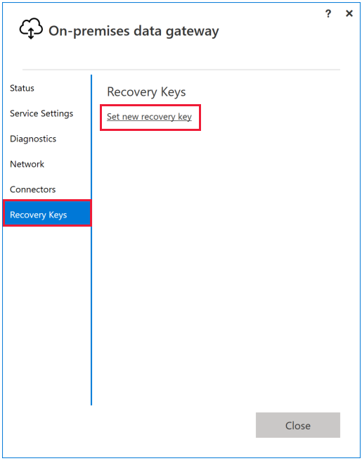
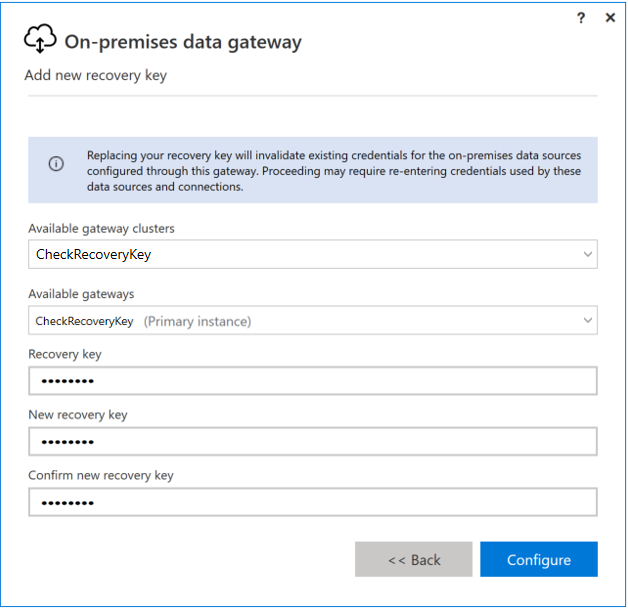
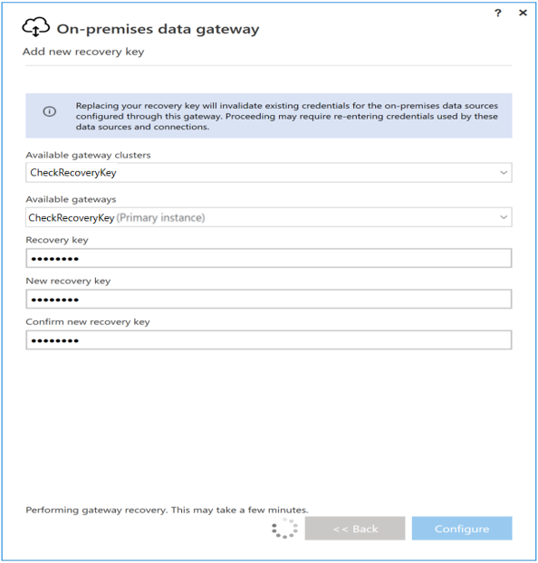
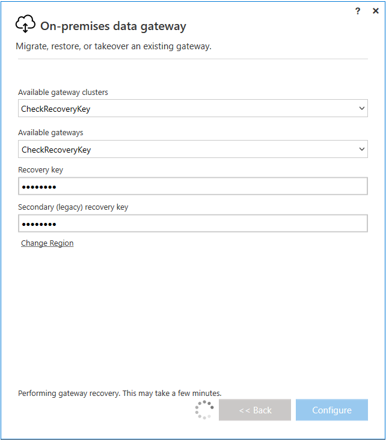

# Change the recovery key for an on-premises data gateway

Starting with the November 2019 version of the on-premises data gateway (version 3000.14.39), you can change the recovery key that you specified during gateway installation.

The gateway uses the recovery key to create additional keys that encrypt data source and connection credentials. For more information about encryption, see _When working with the on-premises data gateway, how are recovery keys used and where are they stored?_ in the [Power BI security whitepaper](/power-bi/whitepaper-powerbi-security#power-bi-security-questions-and-answers).

When you change the key, the process depends on whether you're using the gateway with Power BI or with another service:

- For Power BI, credentials for connections that use the gateway are automatically encrypted again with the new key.

- For other services, like Power Apps and Power Automate, connections aren't automatically encrypted with the new key. You must edit each connection to trigger encryption with the new key.

## Change the recovery key

Use the following steps to change the recovery key.

1. Open the [on-premises data gateway app](service-gateway-app.md) and sign in. If you have multiple gateway member in a cluster, you must sign into the primary member.

1. On the **Recovery Keys** tab, select **Set new recovery key**. In a cluster with more than one member, this action disables all other gateway members. You re-enable these members later in this process.

    

1. Enter the current recovery key and the new one.

    

1. Select **Configure** to change the recovery key. This step performs a recovery of the gateway and encrypts all Power BI data source credentials using the new recovery key.

    

    After you've created the new key, the app shows that there is now a secondary or _legacy_ recovery key. The gateway maintains both keys on the machine where it's installed, so connections that use the legacy recovery key do not fail. If you want to delete the legacy key, see [Delete the legacy recovery key](#delete-the-legacy-recovery-key).

    

1. If you have a gateway cluster with more than one member, perform an [uninstall and recovery](service-gateway-migrate.md) for each gateway member.  The recovery process will ask for both the old and the new key.

1. If you use the gateway with services other than Power BI, edit each connection to trigger encryption with the new key.

## Delete the legacy recovery key

After you've created a new recovery key, you can delete the legacy recovery key. Before deleting the legacy key, make sure all connections using the gateway have had their credentials encrypted with the new key.

1. Open the [on-premises data gateway app](service-gateway-app.md) and sign in. If you have multiple gateway member in a cluster, you must sign into the primary member.

1. On the **Recovery Keys** tab, select **Delete legacy recovery key**.

    

[!INCLUDE[footer-include](../includes/footer-banner.md)]