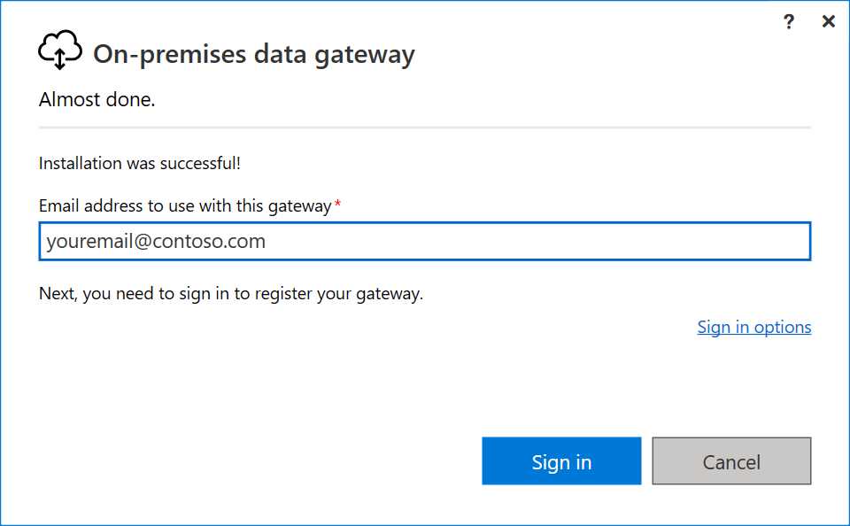

# Change the on-premises data gateway service account

The on-premises data gateway is configured to use *NT SERVICE\PBIEgwService* for the Windows service sign-in credential. In the context of the machine on which you install the gateway, the account by default has the right of Log on as a service.

This service account isn't the account used to connect to on-premises data sources. It also isn't the work or school account that you sign in to cloud services with.

## Change the service account

To change the Windows service account for the on-premises data gateway:

1. Open the [on-premises data gateway app](service-gateway-app.md), select **Service settings**, and then select **Change account**.

   >[!Note]
   > We recommend using the on-premises data gateway app to change the service account instead of the Windows Service app. This will ensure that the new account has all the required privileges. Not using the on-premises data gateway app for this purpose could lead to inconsistent logging and other issues.

   

    The default account for this service is *NT SERVICE\PBIEgwService*. Change this account to a domain user account within your Windows Server Active Directory domain, or use a managed service account to avoid having to change the password.

1. Select **Change account**. You need the recovery key to change the service account.

   

1. Provide the service account and password, and select **Configure**.

   

1. Provide your sign in account, and select **Sign in**.

   

1. On the next windows, select **Migrate, restore or takeover an existing gateway**, and follow the process for [restoring](service-gateway-migrate.md) your gateway.

1. After the restoration is complete, the new gateway uses the domain account.

   
   
   
> [!NOTE]
> To reset the gateway to the default service account, you need to uninstall and reinstall the gateway. You need the recovery key for this operation.
>

## Next steps

* [Set the datacenter region](service-gateway-data-region.md)  
 

[!INCLUDE[footer-include](../includes/footer-banner.md)]