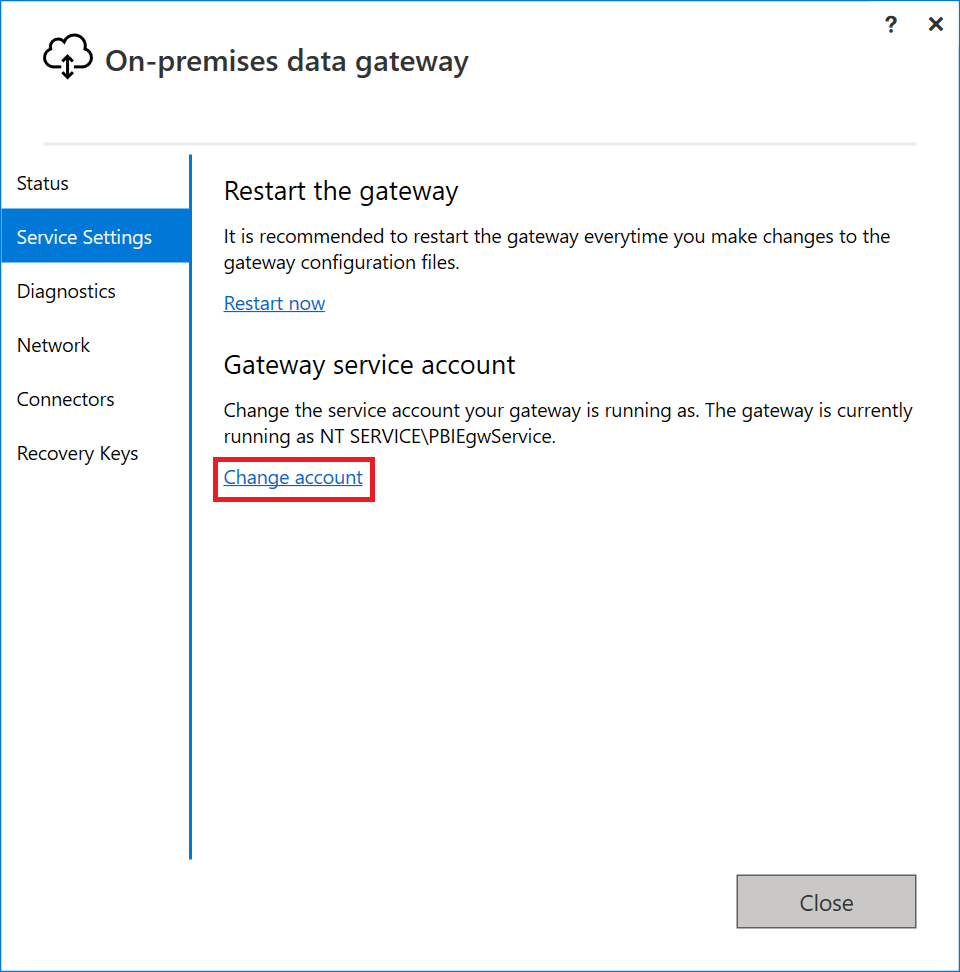

# Change the on-premises data gateway service account

The on-premises data gateway is configured to use *NT SERVICE\PBIEgwService* for the Windows service sign-in credential. In the context of the machine on which you install the gateway, the account by default has the right of Log on as a service.

This service account isn't the account used to connect to on-premises data sources. It also isn't the work or school account that you sign in to cloud services with.

## Change the service account

It is not necessary to change the service account, but you can, if necessary. To change the Windows service account for the on-premises data gateway:

1. Open the [on-premises data gateway app](service-gateway-app.md), select **Service settings**, and then select **Change account**.

   >[!Note]
   > We recommend using the on-premises data gateway app to change the service account instead of the Windows Service app. This will ensure that the new account has all the required privileges. Not using the on-premises data gateway app for this purpose could lead to inconsistent logging and other issues.

   

    The default account for this service is *NT SERVICE\PBIEgwService*. Change this account to a domain user account within your Windows Server Active Directory domain, or use a managed service account to avoid having to change the password.

1. Select **Change account**. You need the recovery key to change the service account.

   

1. Provide the service account and password, and select **Configure**.

   

1. Provide your sign-in account, and select **Sign in**.

   

1. On the next windows, select **Migrate, restore or takeover an existing gateway**, and follow the process for [restoring](service-gateway-migrate.md) your gateway.

1. After the restoration is complete, the new gateway uses the domain account.

   

> [!NOTE]
> To reset the gateway to the default service account, you need to uninstall and reinstall the gateway. You need the recovery key for this operation.

## Switch to a group managed service account (gMSA)

Group managed service accounts (gMSAs) can be used for the data gateway in place of normal accounts. To use a gMSA, you can follow these steps.

1. On a computer with the Remote Server Administration Tools installed, run the following command to configure a KDS Root key (if it has not already been done in your organization):
   ```powershell
   Add-KdsRootKey -EffectiveImmediately
   ```
1. Run the following command to create the group managed service account. Use the **Name** parameter to specify the service account name and the **PrincipalsAllowedToRetrieveManagedPassword** parameter to specify the NetBIOS name of the computers allowed to use the group managed service account.
   ```powershell
   New-ADServiceAccount -Name "PowerBiDGgMSA" -PrincipalsAllowedToRetrieveManagedPassword server1$ -DnsHostName server1.contoso.com -Enabled $True
   ```
   > [!NOTE]
   > The $ at the end of the NetBIOS server name is necessary to indicate the computer account.
   
1. Add the service account to the computer hosting the data gateway.
   ```powershell
   Install-ADServiceAccount -Identity PowerBiDGgMSA
   ```
   > [!NOTE]
   > This step must be performed on the computer hosting the data gateway.

1. On the computer hosting the data gateway, launch the Services applet.
1. Locate the service **On-premises data gateway service** and double-click it to open its properties.
1. Update the service name to the value for the gMSA you wish to use and click **OK**.
   
   > [!NOTE]
   > Be sure to include the $ at the end of the account name. Do not specify a password when using a group managed service account.
1. Select **OK** to acknowledge that the *Logon as a service* right has been granted to the group managed service account.
1. Select **OK** to acknowledge that the service has to be stopped and restarted manually.
1. Restart the service from the Services applet.
1. Launch the On-premises data gateway app. When prompted, sign in as an administrator of the gateway.
1. Select **Migrate, restore, or takeover an existing gateway** and click **Next**.
1. Enter the recovery key that you created when you set up the gatway and click **Configure**.
   
1. Select **Close** to exit the data gateway app configuration.

## Next steps

* [Set the datacenter region](service-gateway-data-region.md)  
