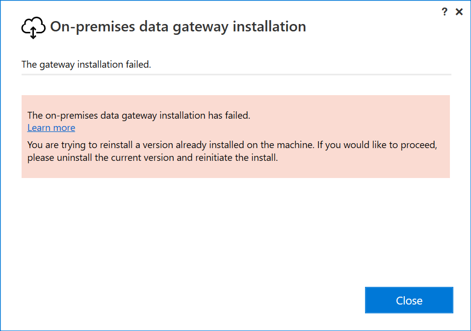
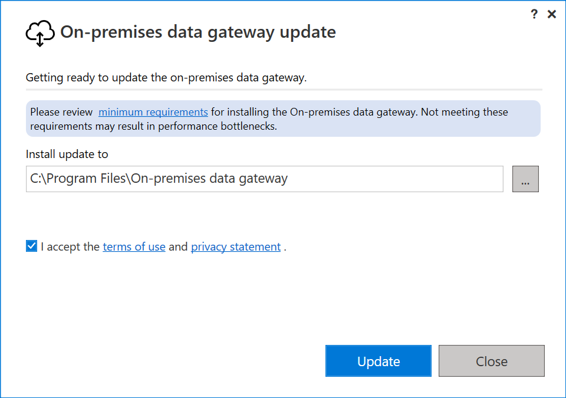

# Update an on-premises data gateway

We release an update every month for on-premises data gateways. Each of these updates includes new features along with the latest Mashup Engine.

> [!NOTE]
>Currently, Microsoft actively supports only the last six releases of the on-premises data gateway. We release a new update for data gateways every month.

> [!NOTE]
> We recommend that you update gateway members one after the other without a long lag. This will reduce sporadic failures as a query may succeed on one gateway member, but not on the other, based on its version. 
Please follow the following steps while updating a gateway cluster with two or more members:
>   1. Disable one gateway member.
>   2. Update the gateway member.
>   3. Enable the updated gateway member.
>   4. Repeat step 1-3 until all gateway members are updated
>
>Disabling a gateway makes sure the load balancer does not try to excecute queries on the member you are updating, hence reducing delays and failures.

## Update a gateway

To update a gateway:

1. Download the latest [standard mode gateway](https://go.microsoft.com/fwlink/?LinkId=2116849&clcid=0x409) or [personal mode gateway](https://go.microsoft.com/fwlink/?LinkId=2116848&clcid=0x409) and run the installation program. If the version you're trying to install isn't newer than the version already installed, you'll receive one of the following error messages.

   

   

1. If you install a newer version, you'll be prompted to update. Select **Update** to begin updating.

   

1. After the installation finishes, select **Sign in**.

   

The gateway update is now complete.

## Next steps

* [Monitor and optimize gateway performance](service-gateway-performance.md)
