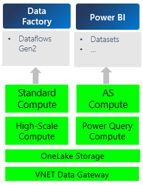

# Virtual network data gateways business and billing model
The virtual network data gateway is a network security offering that lets you connect your Azure and other data services to Microsoft Fabric and the Power Platform. You can run Dataflow Gen2, Power BI Semantic Models, Power Platform Dataflows, and Power BI Paginated Reports on top of a virtual network data gateway. The virtual network data gateway ensures no traffic is exposed to a public endpoint. In addition, you can force all traffic to your datasource to go through a gateway, allowing for comprehensive auditing of secure data sources. To learn more and get started, refer to [virtual network data gateways](overview.md).

## Summary

The virtual network data gateway is billed as an additive premium infrastructure charge, billed to a Premium or Fabric capacity. This means that it has its own meter and incurs a bill that is consistent across and in addition to all artifacts. Total Bill of running an artifact through the virtual network data gateway = artifact charge + virtual network data gateway Charge.

The virtual network data gateway Charge is proportional to your usage of the virtual network data gateway; we define usage as uptime, or anytime the virtual network data gateway is on. A single virtual network data gateway uses two cores. The CU consumption rate is a fixed rate that we decide, depending on what we want to charge. Learn more about CUs [here](/fabric/enterprise/fabric-operations).

- Consumption Unit (CU) consumption rate: 2x
- Price: 2x (CU Consumption rate) * 2 cores (per virtual network data gateway) * $0.18 (Pay as You Go price for one CU per hour) = $0.72 per virtual network/hour

## Best Practices

You can set up your virtual network data gateways for free. There's no cost associated with setting up a virtual network data gateway. You can set up connections today for free. We start to bill when your first query runs or you run a test connection.

To reduce costs, you can actively manage the time to live on your virtual network data gateway in settings. Learn more [here](manage-data-gateways.md#manage-settings).

To check if your virtual network data gateway is on or off, you can use the status icon on the **Manage connections and gateways** page.

The following table summarizes the bill you can expect from using a single virtual network data gateway for the designated amount of time.

## View and Manage your Bill
Virtual network data gateways don't map to a single workspace or artifact. On top of the usual charge you incur for using the artifact, the gateway incurs an extra charge with the operation name **Virtual network data gateway uptime** that costs $0.72 per hour the virtual network data gateway is on. This extra charge covers the infrastructure used to operate the gateway. 

To view your bill, use the Fabric Capacity Metrics app. You will see three line items:

|Item Kind	|Item Name	|Operation |Utilization Type |
|-----------|-----------|----------|-----------------|
|Virtual network data gateway	|Virtual network data gateway |Virtual network data gateway uptime  |Background |
|Dataset 	|Global revenue analytics	|Virtual network data gateway	|Background |
|Dataset	|Global revenue analytics	|Dataset on-demand refresh	|Background |

Description of each line item by Operation name:
•	**Virtual network data gateway uptime** The extra charge from using the virtual network data gateway. This is billed at $0.72/hour and is consistent across all artifacts.
•	**(Dataset) Virtual network data gateway** The charge for compute from executing queries on the M Engine. The Virtual network data gateway hosts the M Engine and reports its usage to the semantic model artifact.
•	**(Dataset) Dataset on-demand refresh** The charge for compute from using the Analysis Services engine to execute the semantic model.

The charges from the item kind dataset should be the same as they would be without using the virtual network data gateway. The virtual network data gateway uptime charge is the only extra charge. 

A diagram illustrating this follows. You can see that under semantic models there are two compute engines (Analysis Service compute and the Power Query or Mashup Engine compute) and one infrastructure item for the Virtual network data gateway that all need to be charged for. If you use OneLake for storage, you would be billed for that too.

If you're using a Premium Power BI capacity, you can learn more about how to view and manage your bill [here](/power-bi/enterprise/service-admin-premium-manage#manage-capacity).
