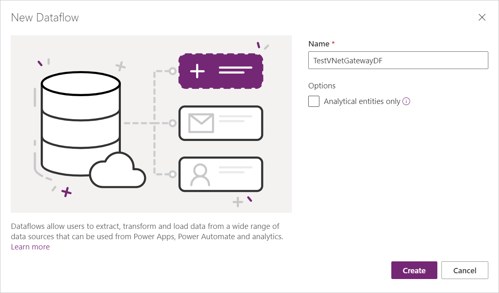
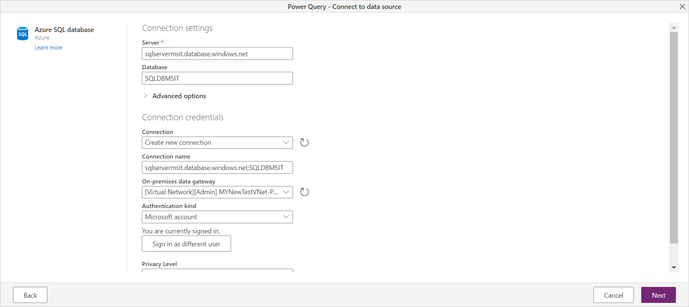
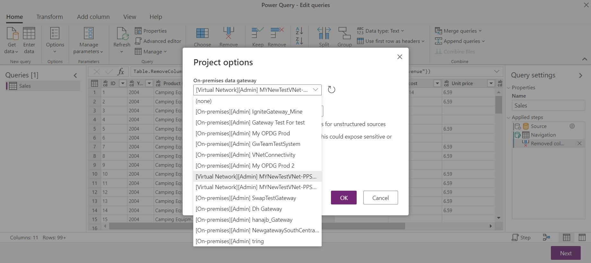

# Use virtual network (VNet) data gateway in Power Platform dataflows

Virtual network data gateways let Power Platform dataflows connect to data services secured in an Azure VNet without the need of an on-premises data gateway. For more information about virtual network data gateways and their limitations, go to [What is a virtual network (VNet) data gateway (Preview)](what-is.md).

>[!Note]
>
>* During public preview, Power platform dataflows users will have access to this feature for *free*. However, licensing requirements might change when VNet data gateways become generally available.
>* For Power Platform dataflows, this feature currently does not support the ability to write to a privatized data lake or Dataverse.

## Connect to data using a VNet data gateway

To connect to data using a VNet data gateway:

1. Create a new dataflow on the Power Apps maker portal. More information: [Create and use dataflows in Power Apps - Power Apps](/powerapps/maker/data-platform/create-and-use-dataflows)

   

2. Once you provide the connection details and then connect to data, you'll now see VNet data gateways included in the **On-premises data gateway** selections.

   

3. Select a VNet data gateway, choose an authentication kind, and then select **Next** to connect and continue with transforming data.

   

You can also update VNet data gateway details just like you do for an on-premises data gateway. In the Power Query editor, select **Home > Options > Project options** while editing your dataflow.

   

## Supported data sources

The following Azure data sources already available on Power Query Online are supported:

* Azure Blobs
* Azure Data Explorer
* Azure Data Lake Storage Gen2
* Azure SQL Database
* Azure Synapse Analytics
* Azure Tables

VNet data gateways aren't supported for:

* data sources requiring 3rd party drivers like SAP, Oracle, and so on
* the [Web](/power-query/connectors/web/web) connector
* the [ODBC](/power-query/connectors/odbc) connector

>[!Note]  
>
>* On-premises data sources can be connected using ExpressRoute, but this configuration hasn't been tested and won't be supported by Microsoft during public preview.
>* Other Cloud data sources can be connected using VNet data gateways, but haven't been tested for public preview.
