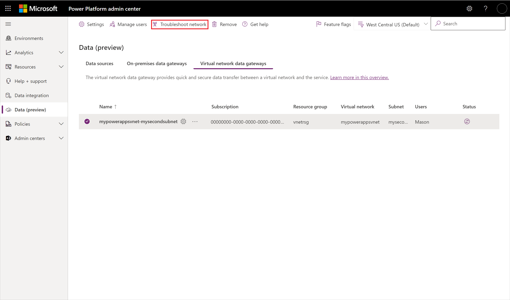
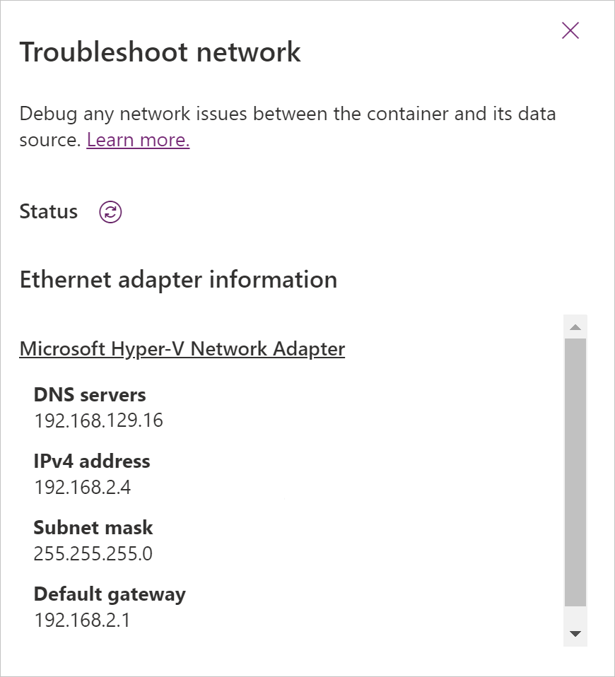
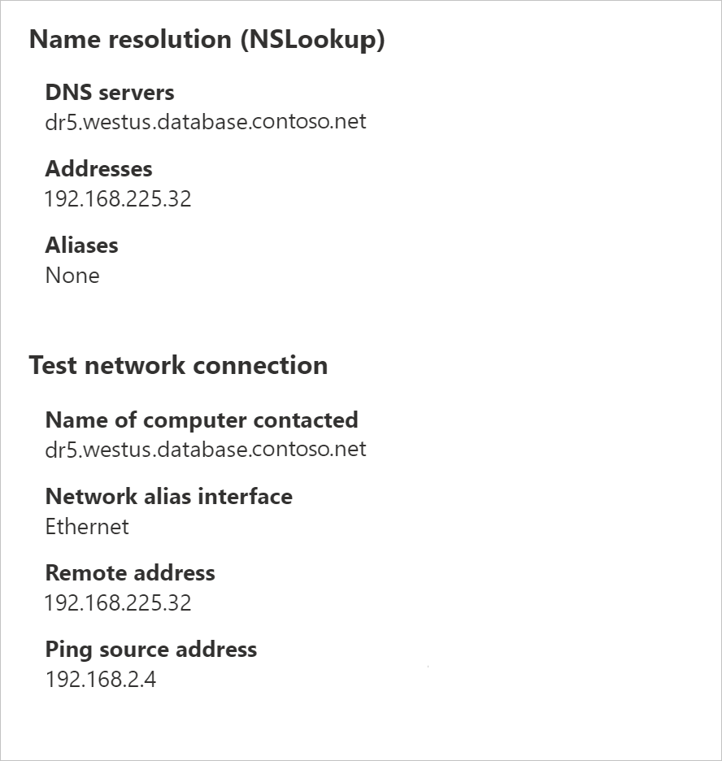

# Troubleshoot a virtual network data gateway network

You can troubleshoot your virtual network data gateway network if you're experiencing network connectivity issues between the gateway and the data sources it needs to connect to.

## What is virtual network data gateway network troubleshooting?

The troubleshooting information includes the following:

* **Ethernet adaptor information**: Provides information about the network settings of the gateway. You can use this  information to check if the Internet Protocol (IP) is expected in the correct subnet and if the Domain Name System (DNS) setting is correct.

* **Name resolution and test network connection**: Provides the capability to troubleshoot connectivity between the container and the endpoint using either the IP or domain name and port. If this test fails, it's likely that the container doesn't respond well. This issue can occur when the DNS doesn't respond with an address or when the network is unavailable. If the network test fails, there's likely an issue with the assignment of the IP configuration of the data source.

## How to troubleshoot the network of the gateway

1. Navigate to [Power Platform admin center](https://admin.powerplatform.microsoft.com/ext/DataGateways).

2. Select **Virtual network data gateways**.

3. Select the gateway you want to troubleshoot and then select **Troubleshoot network** in the ribbon at the top of the page.

   

   _The gateway needs to be active. If the gateway is auto paused, it will be started, and it can take up to 2 minutes for the gateway to become active._

   

   >[!Note]
   >The troubleshooting panel automatically triggers a status check. If the status fails, then the troubleshooting button is disabled because the gateway isn't connected. Refreshing the status will clear the troubleshooting result state.

4. If the status check succeeded, you can see your ethernet adapter information, including the DNS servers, IPv4 address, subnet mask, and the default gateway.

   

5. To test the IP configuration, fill in the IP or Fully Qualified Domain Name (FQDN) and the port number, and then select the troubleshoot button. The input of the port should be a whole number&mdash;decimals and strings aren't allowed.

   
  
>[!Note]
>If you get an `Unable to retrieve <IPConfig/TestNetConnectinon/Host Network> information.` message, retry troubleshooting and ensure you've set the right IP/FQDN and port number.
