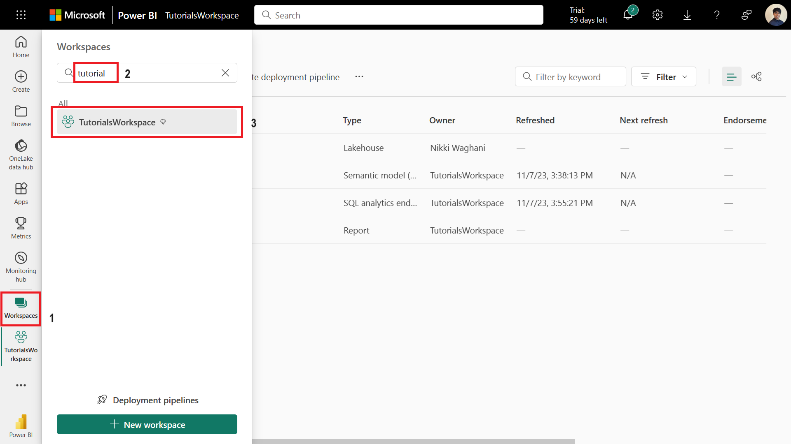
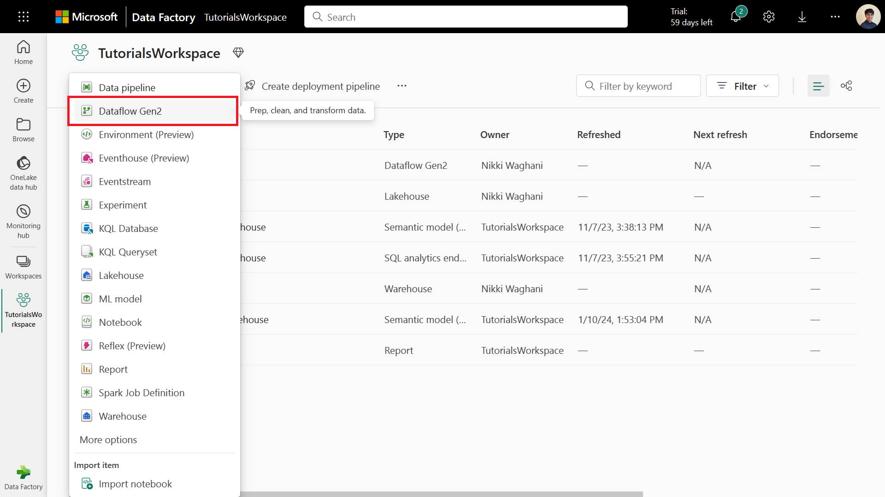
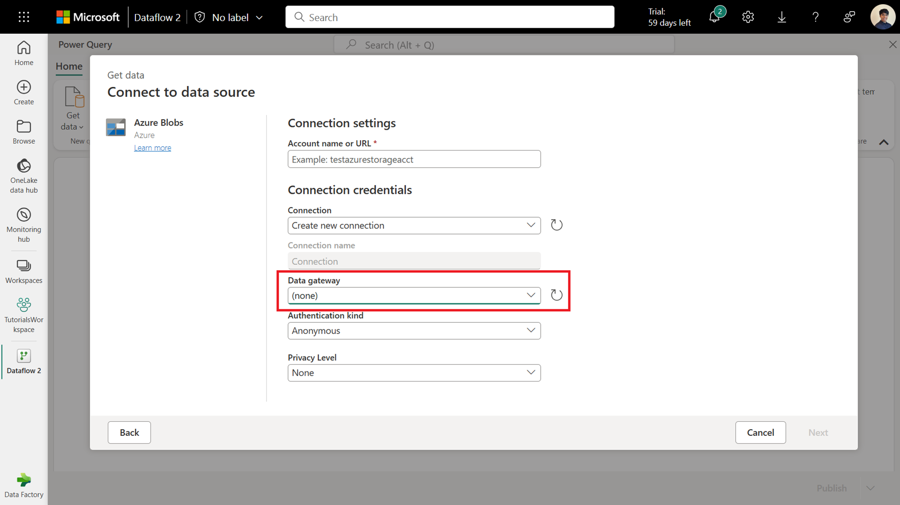

# Run a Fabric Dataflow Gen 2 through the VNet data gateway

To use a Dataflow Gen2 with VNETs:

1. In Fabric, navigate to your workspace by selecting **Workspaces**, and then selecting your workspace.

   

2. Make sure you have selected Data Factory in the bottom left. Then select **New**.

   

3. Select **Dataflow Gen2** from the drop-down menu.

   

4. Select **Get data**. If you open the drop-down menu, select **More**.

   

5. Search for and select your datasource.

6. Input all the necessary connection details for your data source. Under the **Data gateway** header, select the arrow to open the drop-down menu. Select your VNet data gateway from the list, which is prefixed with the **[Virtual network]** tag. If there's no VNet data gateway here, you need to [create one](create-data-gateways.md).

8.	Select **Next**.
9.	Select the data you want to load from your source.
10.	You are now back in the Power Query editor. Apply any transformations to your data here.
11.	Select **Publish**.
12.	You are taken back to your workspace where you can view your new Dataflow Gen2 loading. You can also navigate to the manage connections and gateways page and look under virtual network data gateways to see the new connection to your data source, if you made a new one in step 5.
