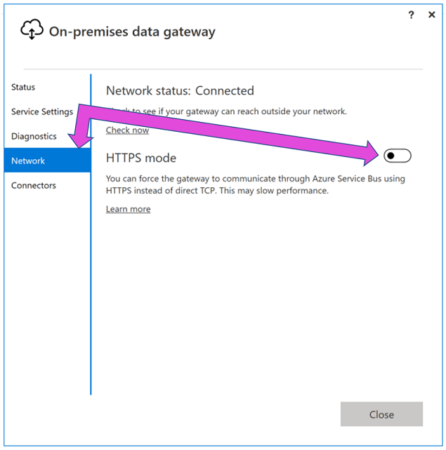

# Adjust communication settings

## Enable outbound Azure connections

The Microsoft on-premises data gateway relies on Azure Service Bus for cloud connectivity, and correspondingly establishes outbound connections to its associated Azure region. By default, this is the region of your Power BI tenant or your Office 356 tenant if you have registered for either of these services. If not, it may be the closest Azure region to you.

If a firewall is blocking outbound connections, you must configure the firewall to allow outbound connections from the on-premises data gateway to its associated Azure region.

### Ports

The Microsoft on-premises data gateway communicates on outbound ports: TCP 443, 5671, 5672, 9350 through 9354. The gateway doesn't require inbound ports.

We recommend that you whitelist the IP addresses, for your data region, in your firewall. You can download the [Microsoft Azure Datacenter IP list](https://www.microsoft.com/download/details.aspx?id=41653), which is updated weekly. Alternatively you can obtain the list of required ports by performing the [Network ports test](service-gateway-tshoot.md#troubleshoot-configuration) on the [on-premises data gateway app](service-gateway-app.md).

The gateway communicates with Service Bus by using the IP address, along with the fully qualified domain name (FQDN). If you're forcing the gateway to communicate by using HTTPS, it will strictly use FQDN only, and no communication happens by using IP addresses.

> [!NOTE]
> The IP addresses listed in the Azure Datacenter IP list are in CIDR notation. For example, 10.0.0.0/24 doesn't mean 10.0.0.0 through 10.0.0.24. Learn more about [CIDR notation](http://whatismyipaddress.com/cidr).

Here's a list of FQDNs used by the gateway:

| Domain names | Outbound ports | Description |
| --- | --- | --- |
| *.download.microsoft.com |80 |Used to download the installer. This is also used by the on-premises data gateway app to check for version and gateway region. |
| *.powerbi.com |443 |Used for identifying the relevant Power BI cluster. |
| *.analysis.windows.net |443 |Used for identifying the relevant Power BI cluster. |
| *.login.windows.net |443 |Used for authenticating the on-premises data gateway app (AAD/OAuth2). |
| *.servicebus.windows.net |5671-5672 |Used for Advanced Message Queuing Protocol (AMQP). |
| *.servicebus.windows.net |443, 9350-9354 |Listens on Service Bus Relay over TCP (requires 443 for Access Control token acquisition). |
| *.frontend.clouddatahub.net |443 |Deprecated - Not required. Will be removed from the public documentation as well. |
| *.core.windows.net |443 |Used by data flows in Power BI to write data to Azure data lake. |
| login.microsoftonline.com |443 |Used for authenticating the on-premises data gateway app (AAD/OAuth2). |
| *.msftncsi.com |443 |Used to test internet connectivity if the gateway is unreachable by the Power BI service. |
| *.microsoftonline-p.com |443 |Used for authenticating the on-premises data gateway app (AAD/OAuth2). |

> [!NOTE]
> Once the gateway is installed and registered, the only required ports/IPs are the ones needed by the Azure service bus (servicebus.windows.net in the table above). You can obtain the list of required ports by performing the [Network ports test](service-gateway-tshoot.md#troubleshoot-configuration) in the on-premises data gateway app. Additionally you could also force the gateway to [communicate using HTTPS](service-gateway-communication.md#force-https-communication-with-azure-service-bus).

## Force HTTPS communication with Azure Service Bus

You can force the gateway to communicate with Azure Service Bus by using HTTPS instead of direct TCP. Using HTTPS might have only a negligible effect on performance.

You can use the [on-premises data gateway app](service-gateway-app.md) to force the gateway to adopt this behavior. In the on-premises data gateway app, select **Network**, and then switch the **HTTPS mode** to **On**.



After you make this change, when you select **Apply** (a button that only appears when you make a change), the gateway Windows service restarts automatically so the change can take effect.

For future reference, to restart the gateway Windows service from the on-premises data gateway app, see [Restart a gateway](service-gateway-restart.md).

> [!NOTE]
>If the gateway can't communicate by using TCP, it falls back automatically to HTTPS. The selection in the on-premises data gateway app always reflects the current value.

## TLS 1.2 for gateway traffic

By default, the Microsoft on-premises data gateway uses Transport Layer Security (TLS) 1.2 to communicate with the Microsoft Power BI service. To ensure all gateway traffic uses TLS 1.2, you might have to add or modify the following registry keys on the machine running the gateway service:

```
[HKEY_LOCAL_MACHINE\SOFTWARE\Microsoft\.NETFramework\v4.0.30319]"SchUseStrongCrypto"=dword:00000001
[HKEY_LOCAL_MACHINE\SOFTWARE\Wow6432Node\Microsoft\.NETFramework\v4.0.30319]"SchUseStrongCrypto"=dword:00000001
```

> [!NOTE]
> Adding or modifying these registry keys applies the change to all .NET applications. For information about registry changes that affect TLS for other applications, see [Transport Layer Security (TLS) registry settings](https://docs.microsoft.com/windows-server/security/tls/tls-registry-settings).

## Next steps

* [Configure the gateway log file](service-gateway-log-files.md)  
